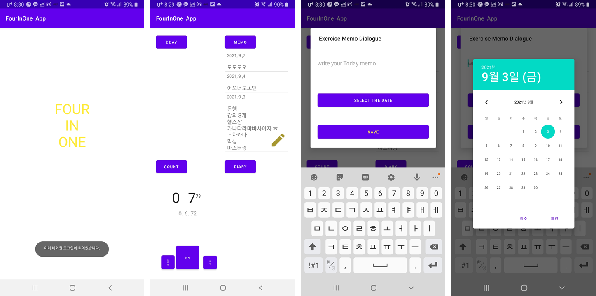

## Fourinone App


### 만들게 된 동기
 1. 대학 동기들과 열품타 어플을 이용하던 중 MeMo, D-day 기능이 아쉽다고 느낌. 개선하여 사용하면 편할 것이라고 생각.
2. 열품타에서의 문제점은 공부 타이머를 킨 상태에서 오늘 할일을 미리 적어놓은 메모장을 보기가 생각보다 번거로움. 그 지점에서 시작하여 매일 계획한 일과 주나 월 단위로 해야하는 일을 한개의 어플로 관리하고 취침 전에 정리를 할 수 있다면 편리할 것이라고 생각했다.

### 개발 방향과 시행착오
1. navigation과 Fragment 기능을 이용하여 Home_fragment에서 4분할로 D-day Calendar, MemoPad, StopWatch, Diary 의 미리보기 화면이 보이게 함.
2. 각 Fragment의 Layout(혹은 Button)을 클릭 시 각각의 메인 Fragment로 이동. 더 크고 관리하기 쉬운 화면으로 이용 가능하게.

    - Home_Fragment에서 다른 Fragment로 이동 후 다시 Fragment를 종료할때


content

1. nub1


- list1
- list2


> 인용구

```kotlin
def fucntion(a):
    pring(a)
    return a
```

